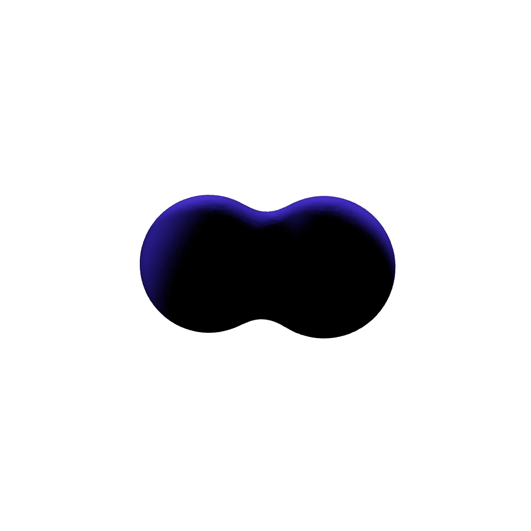
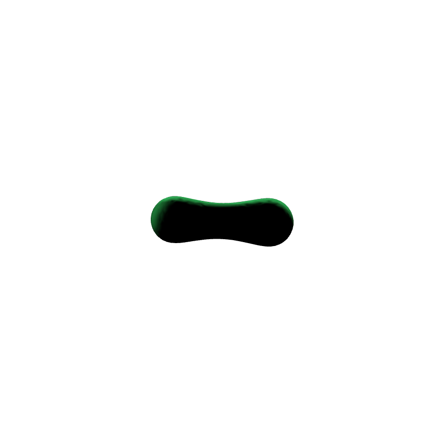
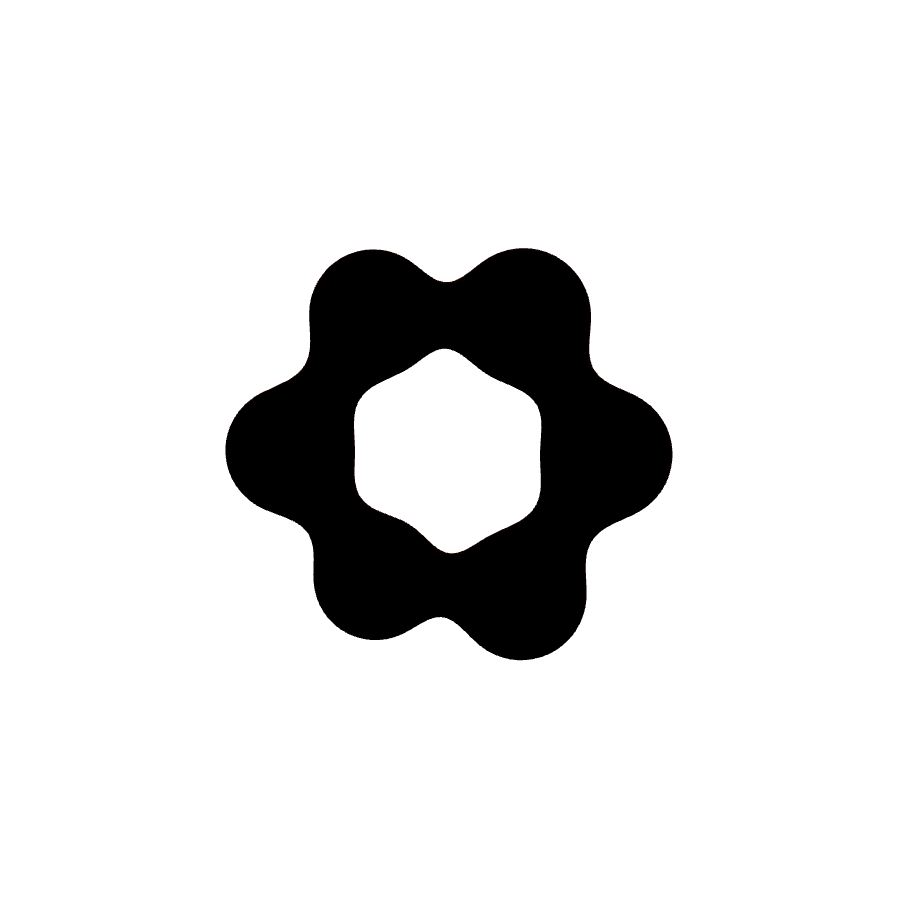
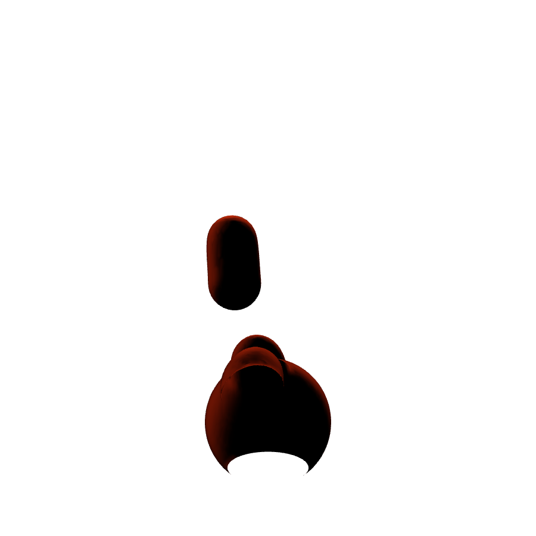
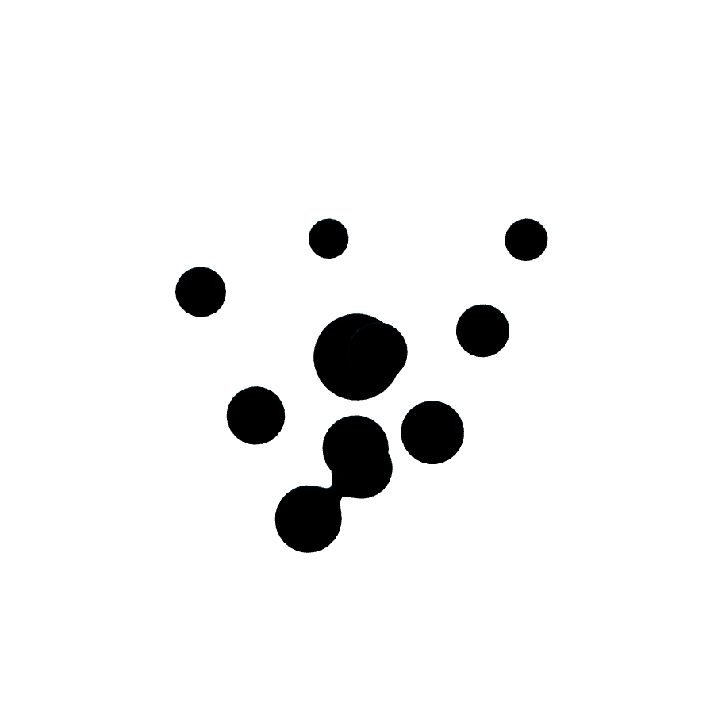
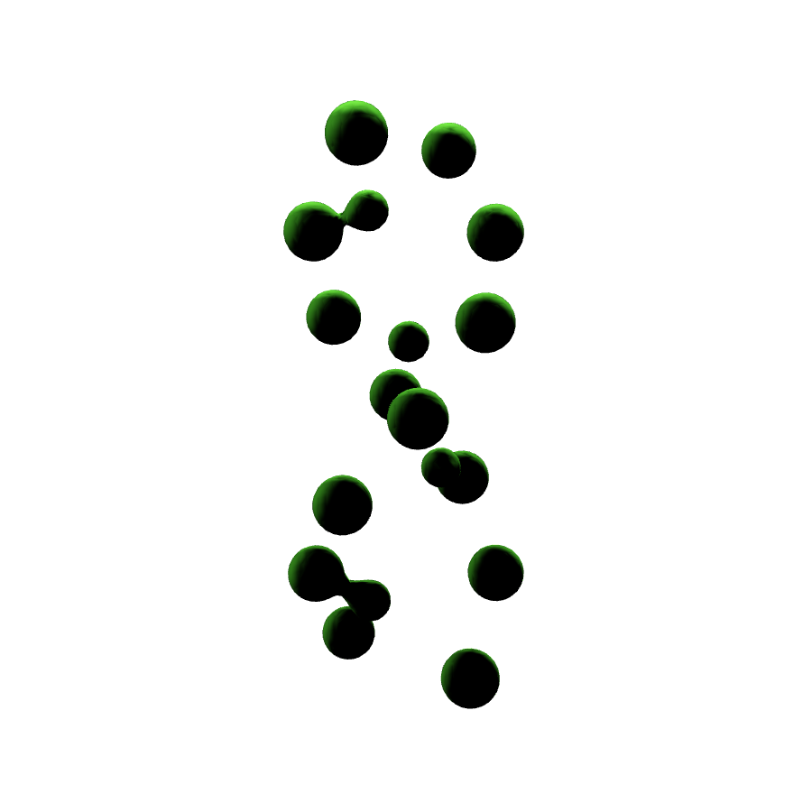
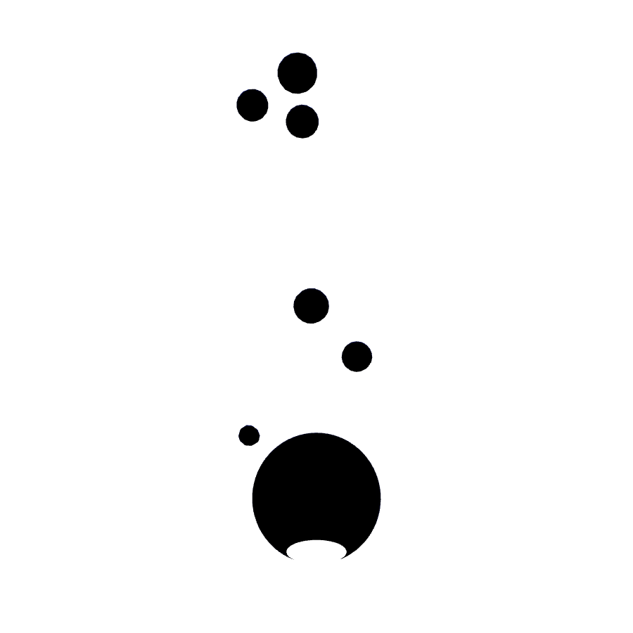
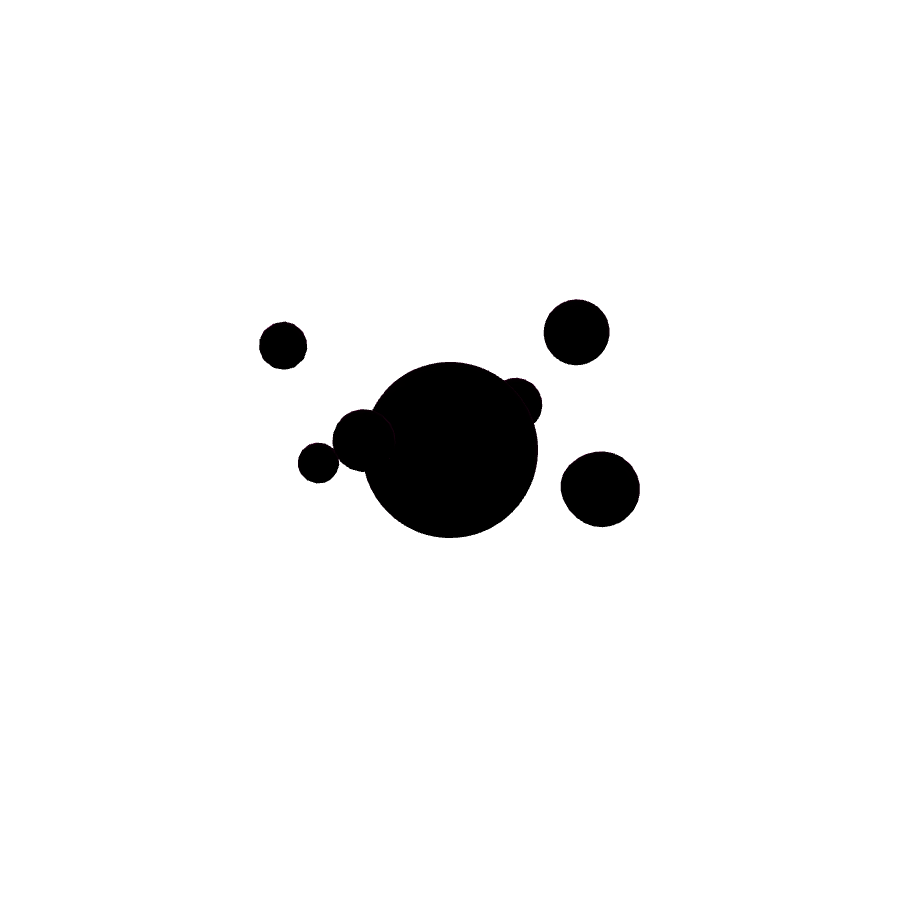

# DicyaninMetaballs

GPU metaball rendering for visionOS RealityKit. Pure Metal compute (scalar field + marching cubes) writing directly into a `LowLevelMesh`, driven by the RealityKit Entity Component System. Zero per-frame CPU meshing, single readback of one vertex count.

## Requirements

- visionOS 2.0+
- RealityKit `LowLevelMesh`

## Usage

```swift
import DicyaninMetaballs
import RealityKit
import SwiftUI

struct MetaballView: View {
    var body: some View {
        RealityView { content in
            DicyaninMetaballs.register()

            let field = Entity.metaballField(
                configuration: .init(
                    resolution: [64, 64, 64],
                    boundsMin: [-0.5, -0.5, -0.5],
                    boundsMax: [0.5, 0.5, 0.5]),
                materials: [SimpleMaterial(color: .cyan, roughness: 0.1, isMetallic: true)])

            field.addChild(Entity.metaball(position: [-0.1, 0, 0], radius: 0.2))
            field.addChild(Entity.metaball(position: [0.1, 0, 0], radius: 0.2))
            content.add(field)
        }
    }
}
```

Move, add, or remove any child entity with a `MetaballComponent` and the surface regenerates on the GPU. Negative `strength` carves holes.

## Gallery

Rendered offscreen on macOS with `RealityRenderer` via the `MetaballGallery` executable in `../RenderGallery`.

### Parameters

| Two-ball merge | Cluster | Carved hole |
| --- | --- | --- |
|  |  |  |
| Two overlapping balls, `isoValue` 0.5. | Four balls fused into one surface. | Positive base ball, negative ball gouging a pit. |

| Low iso (blobby) | High iso (tight) | Quality grid |
| --- | --- | --- |
|  |  |  |
| Same balls, `isoValue` 0.2: fatter, more fused. | Same balls, `isoValue` 0.85: tighter, separated. | Six-ball ring on the `.quality` 96^3 grid. |

### Presets

| Lava lamp | Vortex | DNA helix |
| --- | --- | --- |
|  |  |  |

| Rain merge | Pulse core |
| --- | --- |
|  |  |

Each preset is a single animated frame sampled from `MetaballPreset.balls(at:)`.

## Architecture

- `MetaballFieldComponent`: field volume config on a parent entity.
- `MetaballComponent`: per-ball radius, strength, enable flag on any descendant.
- `MetaballSystem`: ECS system, gathers balls, dispatches GPU work.
- `MetaballFieldRenderer`: Metal pipelines, field buffer, `LowLevelMesh` output.
- `Shaders/Metaballs.metal`: Wyvill falloff field kernel, marching cubes kernel with gradient normals.

## Performance notes

- `regeneratesOnlyOnChange` (default true) hashes ball state and skips idle frames.
- One update in flight at a time; frames arriving while the GPU is busy are dropped, never queued.
- Presets: `.performance` (48^3 grid), default (64^3), `.quality` (96^3).
- Vertex budget is a hard cap; overflow triangles are dropped safely on the GPU.
