# DicyaninPackages

A collection of reusable visionOS Swift packages.

## Packages

| Package | Description |
|---------|-------------|
| [DicyaninHandGesture](https://github.com/hunterh37/DicyaninHandGesture) | Hand gesture recording, recognition, and playback |
| [DicyaninAssetPreloader](./DicyaninAssetPreloader) | Asset preloading utilities |
| [DicyaninEntityManagement](./DicyaninEntityManagement) | Entity management framework |
| [DicyaninEntityQueries](./DicyaninEntityQueries) | Entity query system |
| [DicyaninGrabbableObject](./DicyaninGrabbableObject) | Grabbable object interactions |
| [DicyaninMockHandTracking](./DicyaninMockHandTracking) | Mock hand tracking for testing |
| [DicyaninSceneReconstruction](./DicyaninSceneReconstruction) | Scene reconstruction utilities |
| [DicyaninVFXBudget](./DicyaninVFXBudget) | VFX budget management |
| [DicyaninVirtualJoystick](./DicyaninVirtualJoystick) | Virtual joystick input |

## Component Gallery

Screenshots below are rendered offscreen with RealityKit on macOS by the
[`RenderGallery`](./RenderGallery) tool (`swift run RenderGallery`), which loads
each macOS-buildable spatial component, renders it via `RealityRenderer`, and
writes PNGs.

### DicyaninHumanoidMesh

| A-Pose | T-Pose | Sitting |
|--------|--------|---------|
|  | 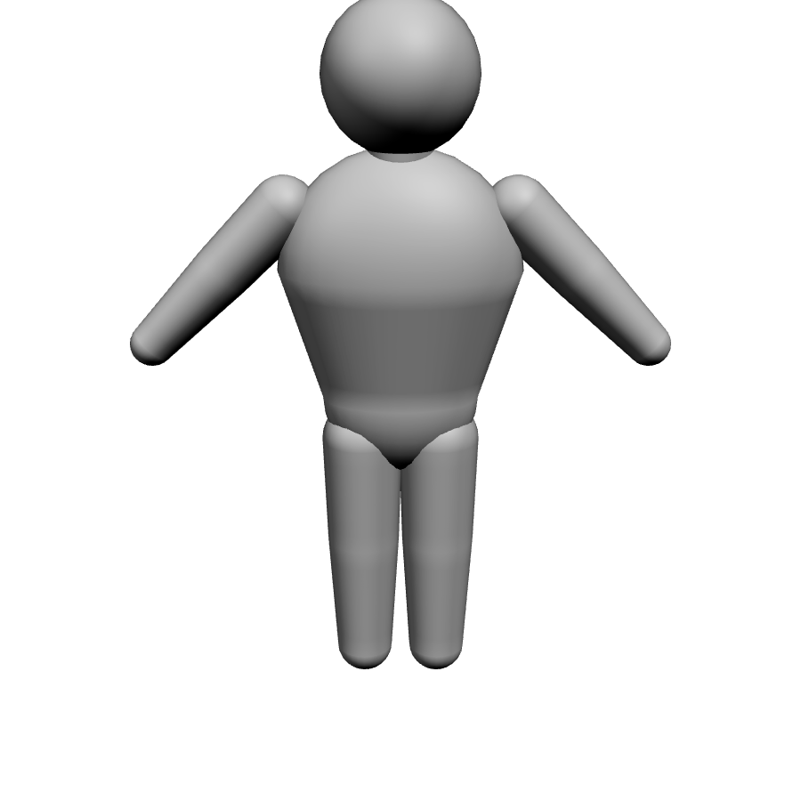 | 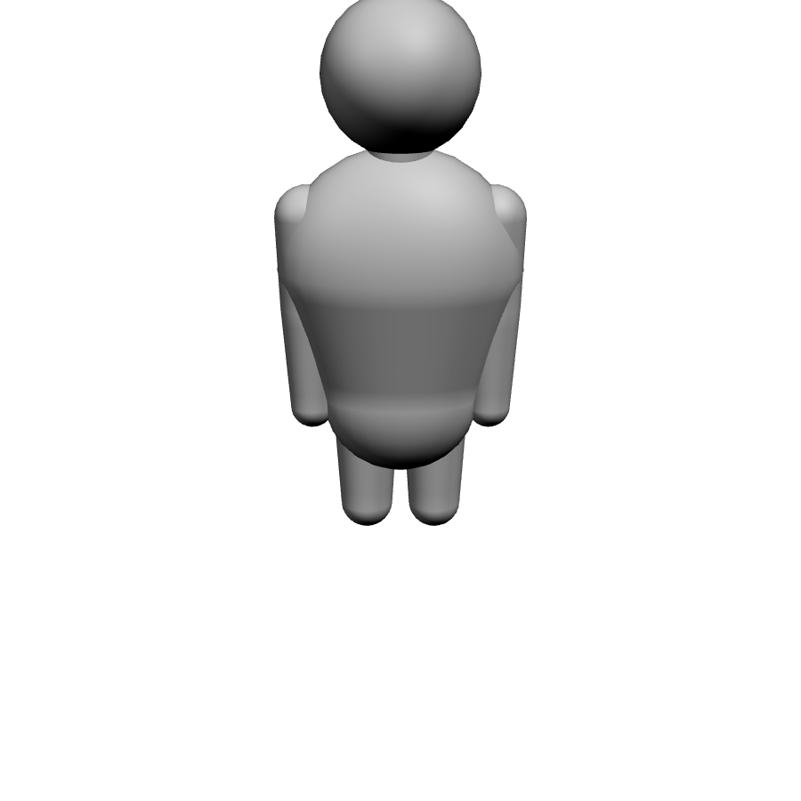 |

| Yoga Tree | Dabbing | Big Wave |
|-----------|---------|----------|
| 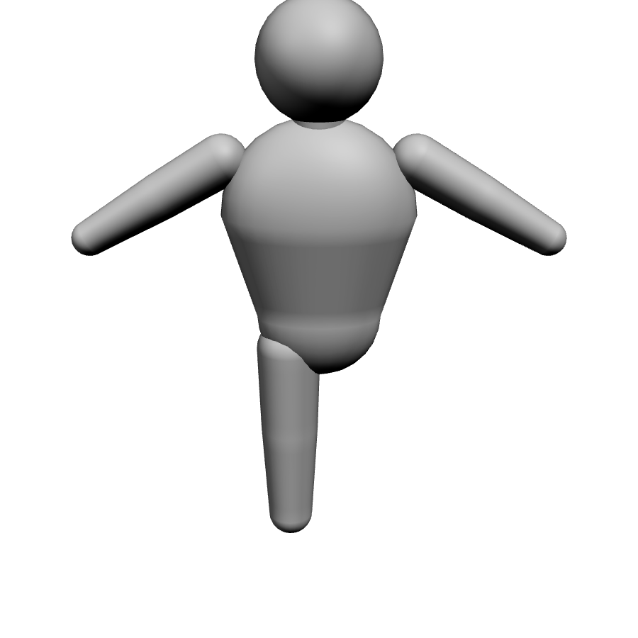 | 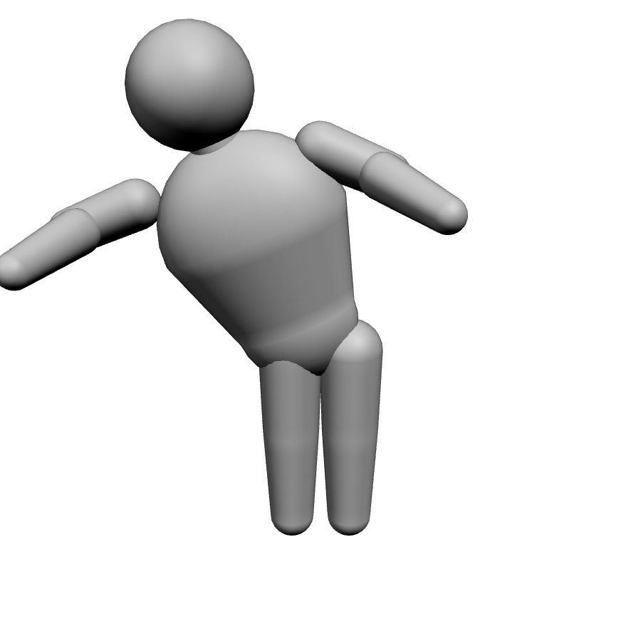 | 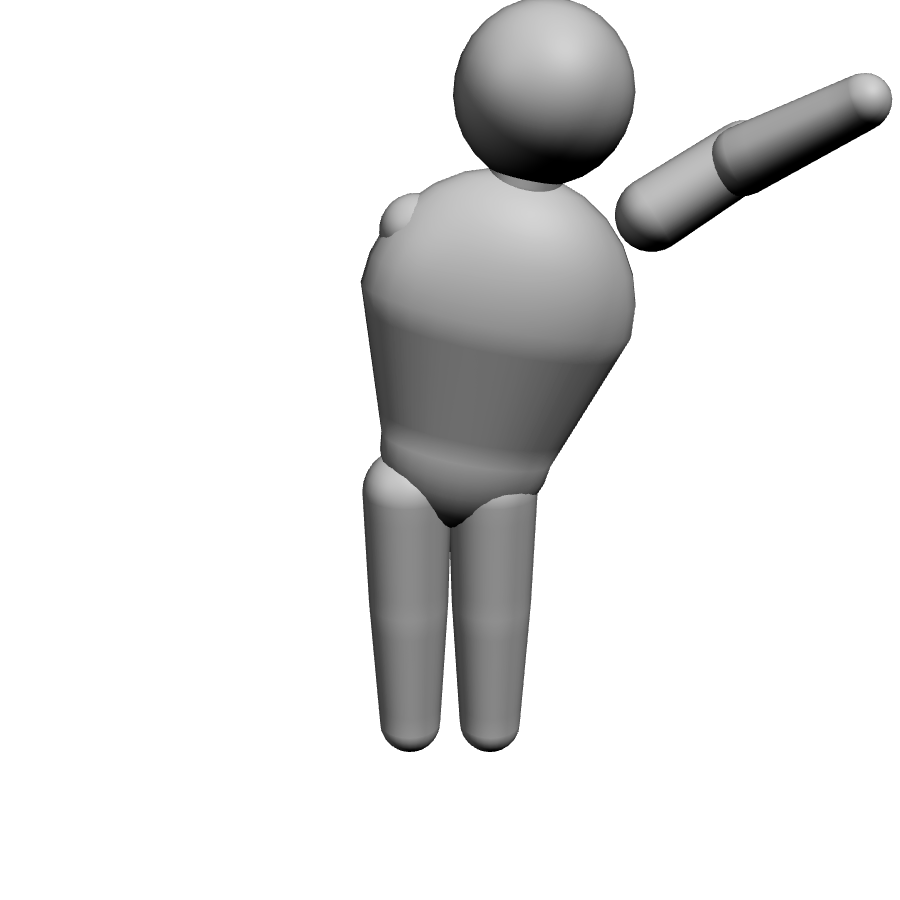 |

### DicyaninSpatialUI

| Curved Panel | Button | Toggle Button |
|--------------|--------|---------------|
| 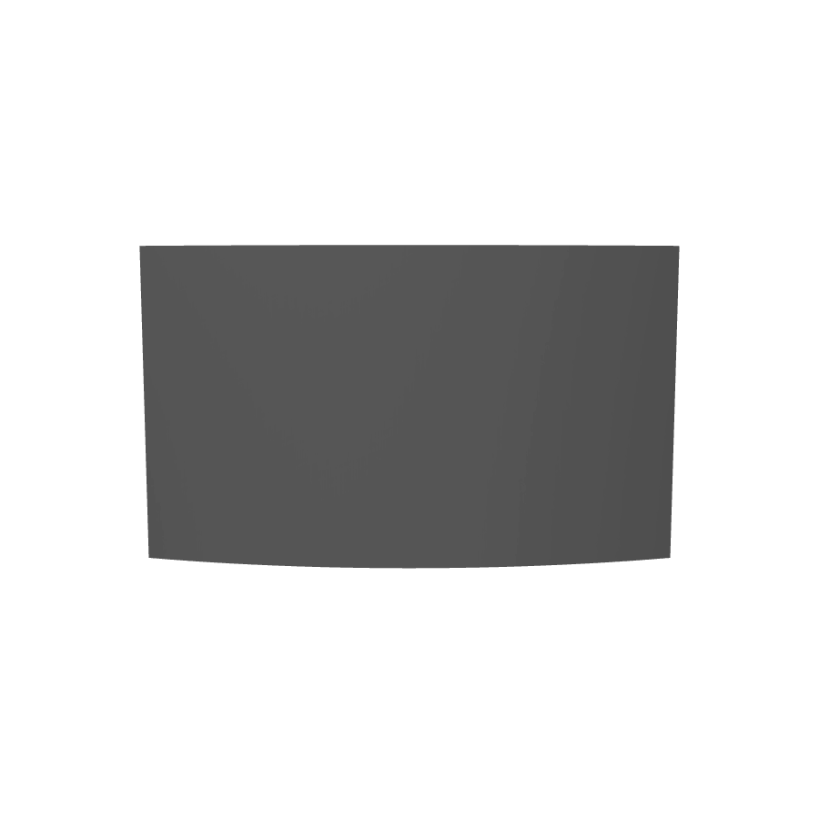 |  |  |

| Slider | Radial Menu | Tooltip |
|--------|-------------|---------|
| 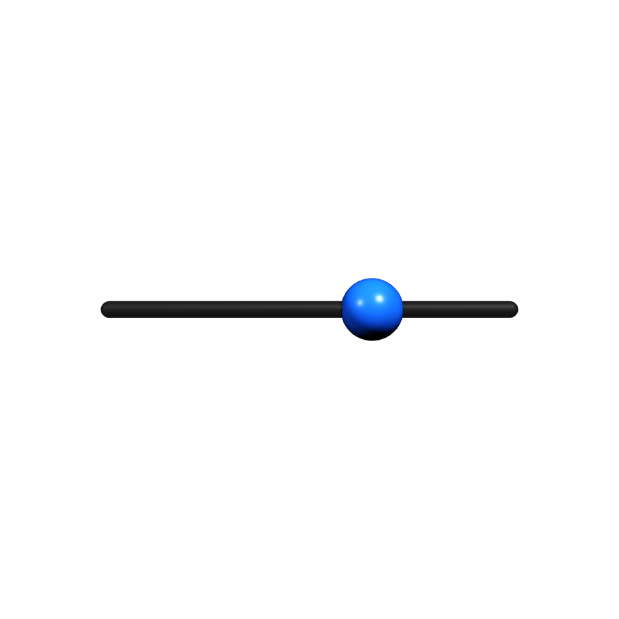 | 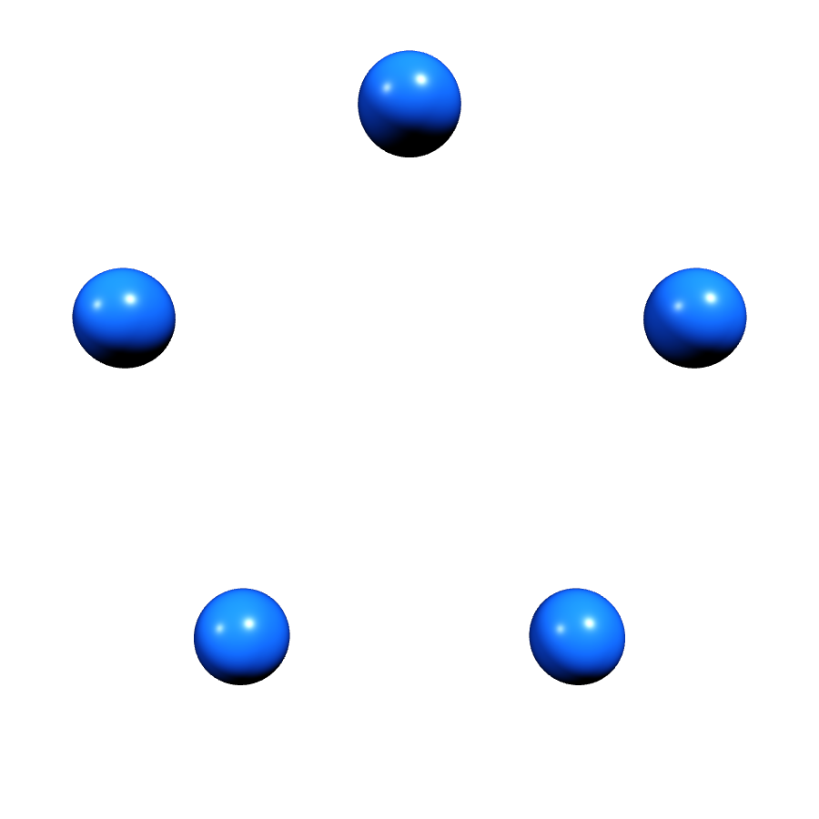 |  |

### DicyaninVirtualJoystick

| 3D Gamepad | Angled | Arcade Pillar |
|------------|--------|---------------|
| 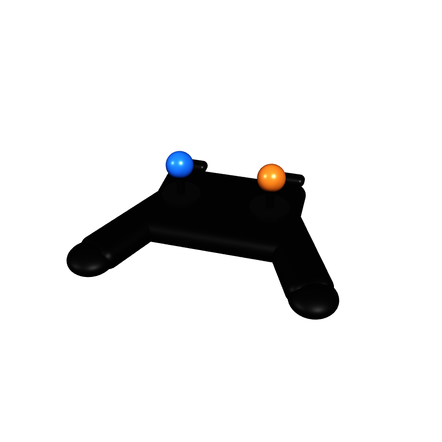 | 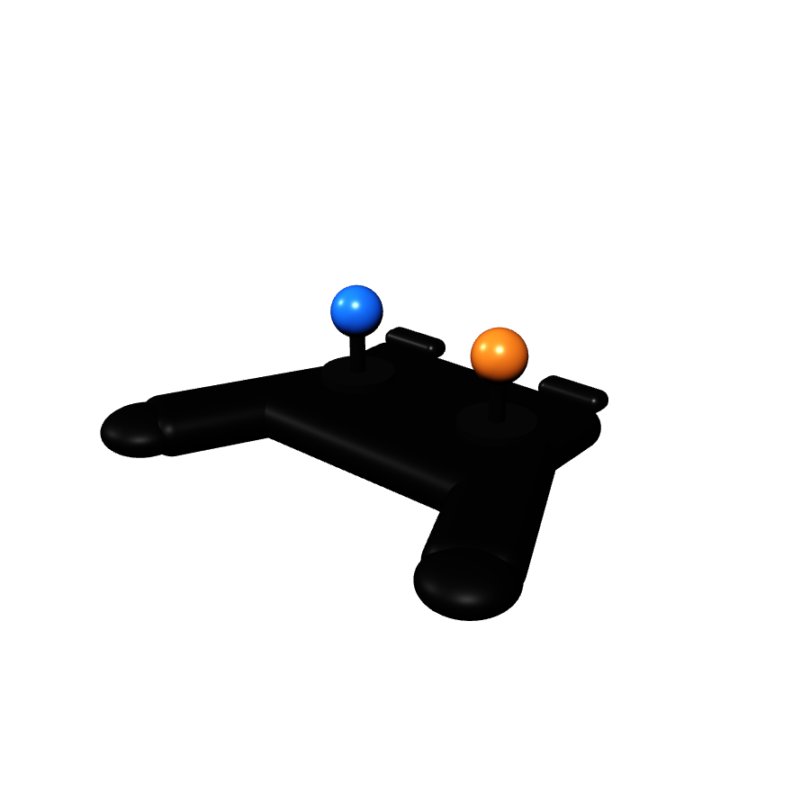 | 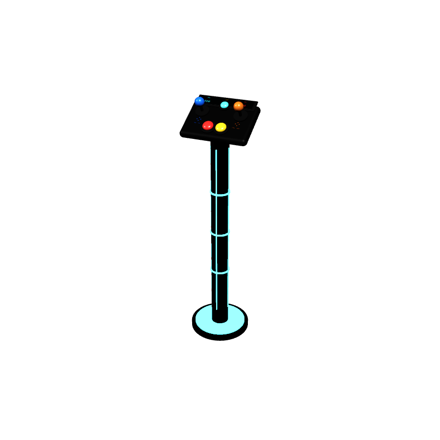 |
