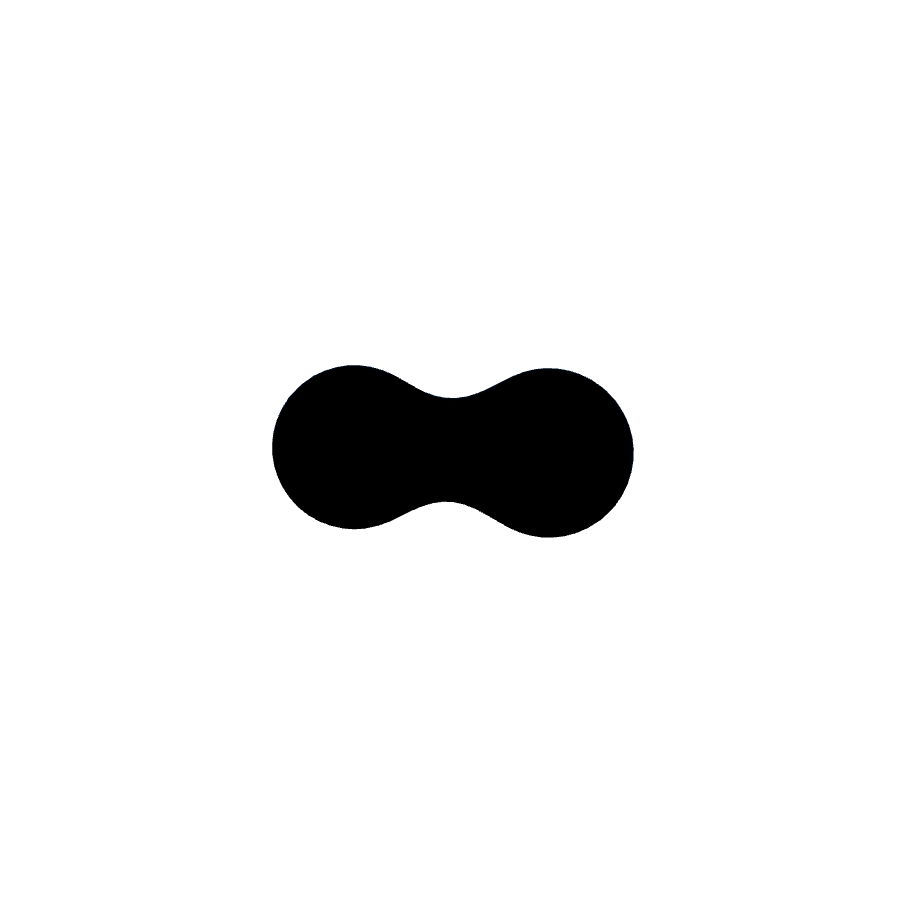
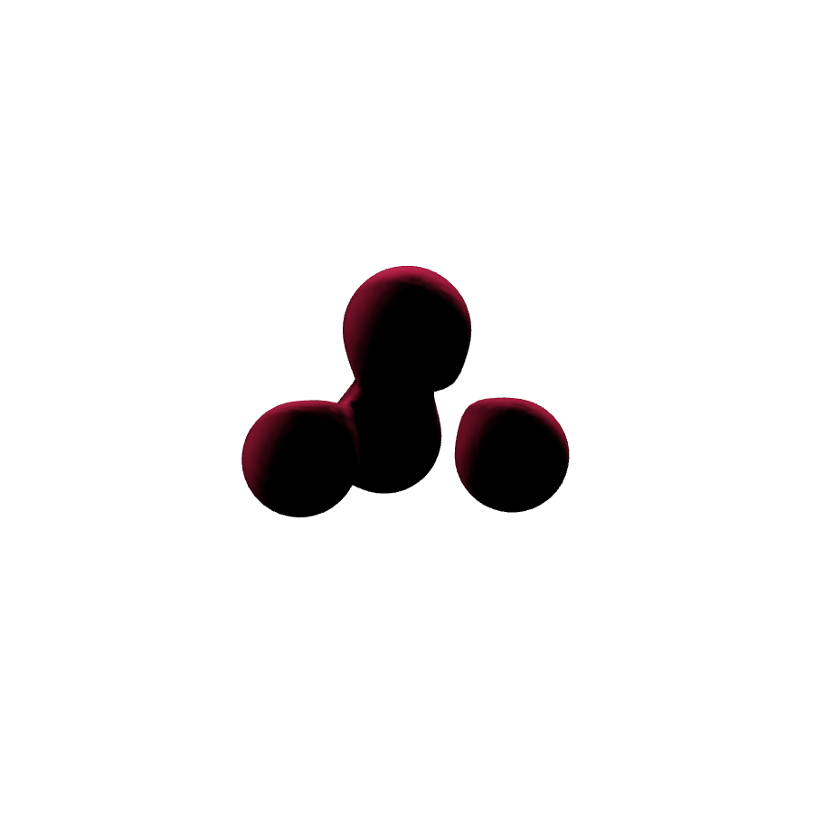
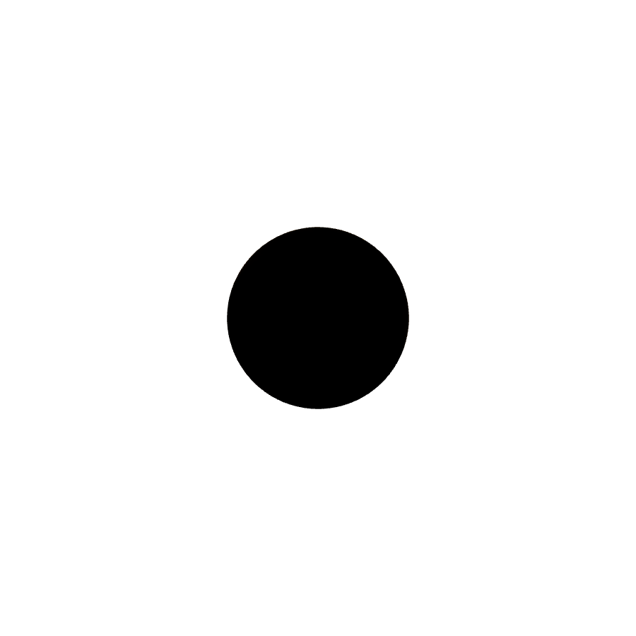
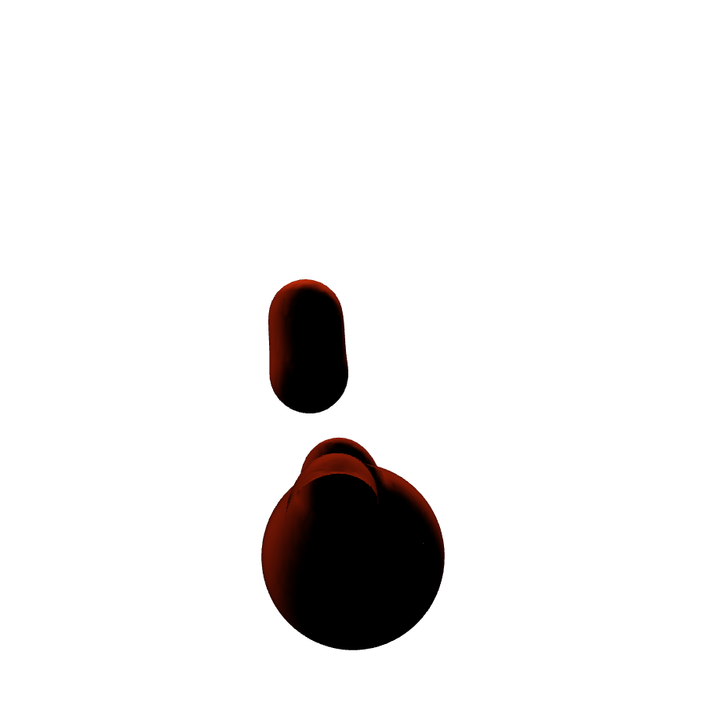
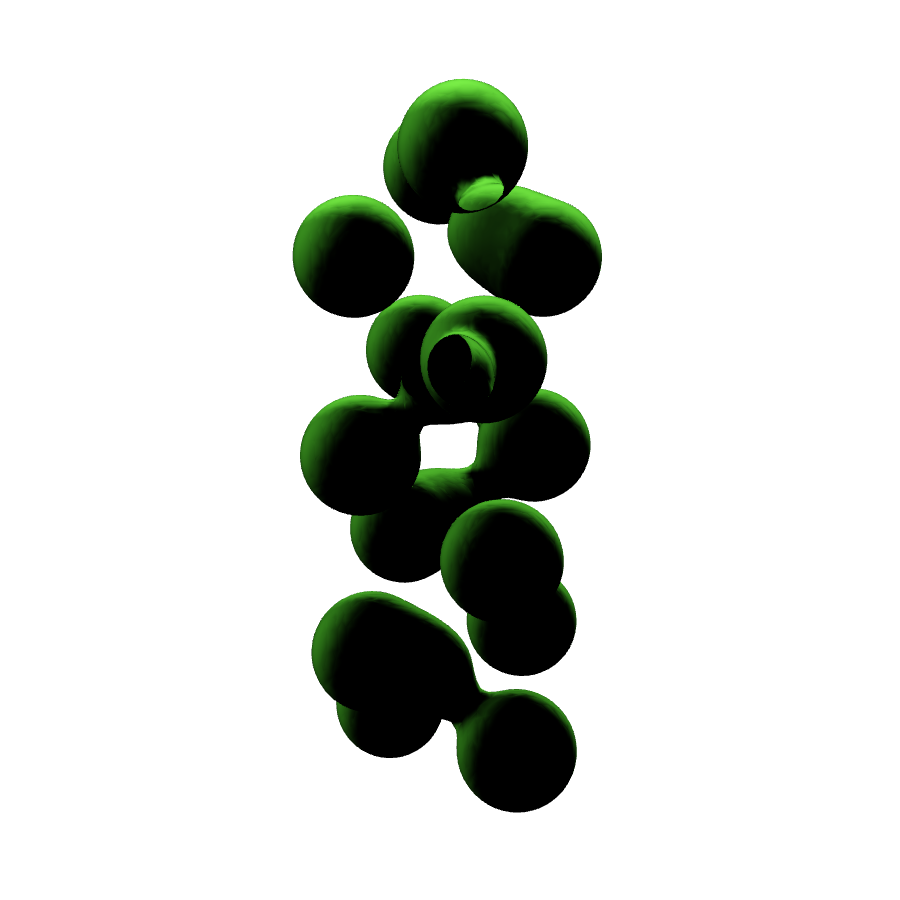
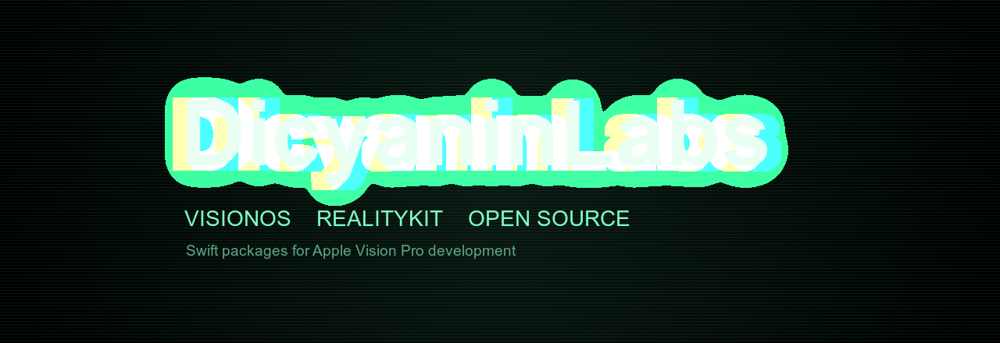

# DicyaninPackages

A collection of reusable visionOS Swift packages.

## Packages

| Package | Description |
|---------|-------------|
| [DicyaninAssetPreloader](./DicyaninAssetPreloader) | Asset preloading utilities |
| [DicyaninDeviceController](./DicyaninDeviceController) | Device controller input |
| [DicyaninEntityManagement](./DicyaninEntityManagement) | Entity management framework |
| [DicyaninEntityQueries](./DicyaninEntityQueries) | Entity query system |
| [DicyaninGamecenterWrapper](./DicyaninGamecenterWrapper) | Game Center integration wrapper |
| [DicyaninGestureTipGhostHands](./DicyaninGestureTipGhostHands) | Ghost hand gesture tips |
| [DicyaninGrabbableObject](./DicyaninGrabbableObject) | Grabbable object interactions |
| [DicyaninHandGesture](https://github.com/hunterh37/DicyaninHandGesture) | Hand gesture recording, recognition, and playback |
| [DicyaninHandMenu](./DicyaninHandMenu) | Hand-anchored menu UI |
| [DicyaninHomeDioramaScene](./DicyaninHomeDioramaScene) | Home diorama scene |
| [DicyaninHUDAnchoredView](./DicyaninHUDAnchoredView) | Head-anchored HUD for RealityView attachments |
| [DicyaninHumanoidMesh](./DicyaninHumanoidMesh) | Humanoid mesh and poses |
| [DicyaninLabsMoCapRecording](./DicyaninLabsMoCapRecording) | Motion capture recording |
| [DicyaninMapNavigation](./DicyaninMapNavigation) | Map navigation |
| [DicyaninMetaballs](https://github.com/hunterh37/DicyaninMetaballs) | Metaball rendering effects |
| [DicyaninMockHandTracking](./DicyaninMockHandTracking) | Mock hand tracking for testing |
| [DicyaninRoomFX](./DicyaninRoomFX) | Room-scale visual effects |
| [DicyaninSceneMovement](./DicyaninSceneMovement) | Scene movement utilities |
| [DicyaninSceneReconstruction](./DicyaninSceneReconstruction) | Scene reconstruction utilities |
| [DicyaninSimulatorInput](./DicyaninSimulatorInput) | Simulator input support |
| [DicyaninSpatialUI](https://github.com/hunterh37/DicyaninSpatialUI) | Spatial UI components |
| [DicyaninSplash](./DicyaninSplash) | Splash screen |
| [DicyaninTextFX](./DicyaninTextFX) | Text visual effects |
| [DicyaninToonShader](./DicyaninToonShader) | Toon shading |
| [DicyaninVFXBudget](./DicyaninVFXBudget) | VFX budget management |
| [DicyaninVirtualJoystick](./DicyaninVirtualJoystick) | Virtual joystick input |
| [DicyaninWatchLink](./DicyaninWatchLink) | Apple Watch connectivity |

## Component Gallery

Screenshots below are rendered offscreen with RealityKit on macOS by the
[`RenderGallery`](./RenderGallery) tool (`swift run RenderGallery`), which loads
each macOS-buildable spatial component, renders it via `RealityRenderer`, and
writes PNGs.

### DicyaninHumanoidMesh

| A-Pose | T-Pose | Sitting |
|--------|--------|---------|
|  |  |  |

| Yoga Tree | Dabbing | Big Wave |
|-----------|---------|----------|
|  |  |  |

### DicyaninSpatialUI

| Curved Panel | Button | Toggle Button |
|--------------|--------|---------------|
|  |  |  |

| Slider | Radial Menu | Tooltip |
|--------|-------------|---------|
|  |  |  |

### DicyaninVirtualJoystick

| 3D Gamepad | Angled | Arcade Pillar |
|------------|--------|---------------|
|  |  |  |

### DicyaninMetaballs

| Two-Ball Merge | Cluster | Carved Hole |
|----------------|---------|-------------|
|  |  |  |

| Lava Lamp | Vortex | DNA Helix |
|-----------|--------|-----------|
|  |  |  |

---

  

